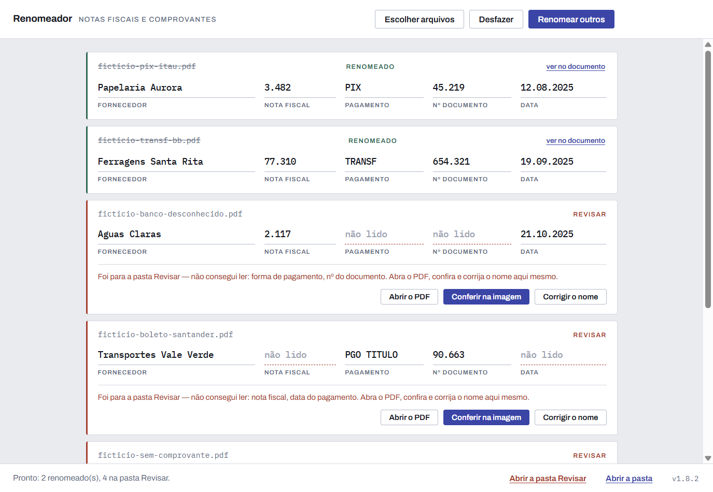
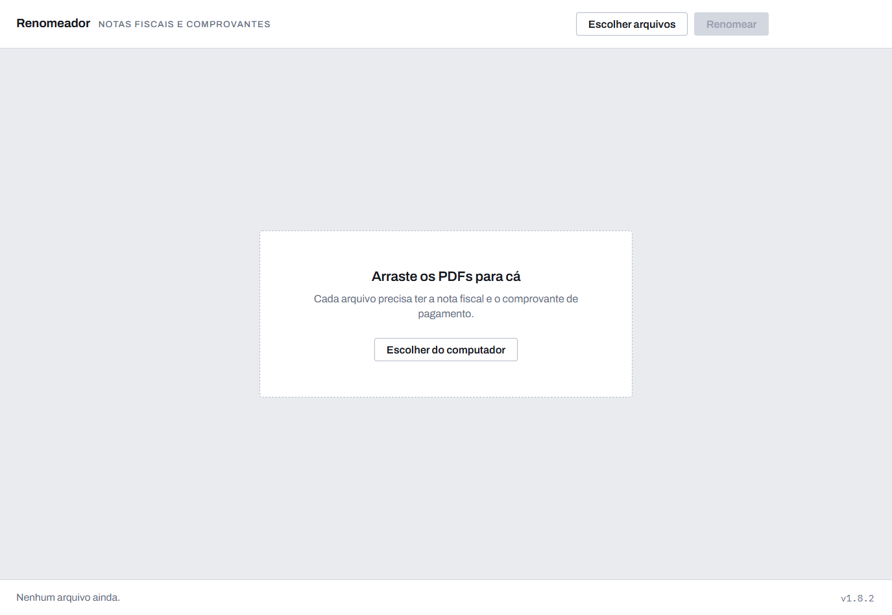
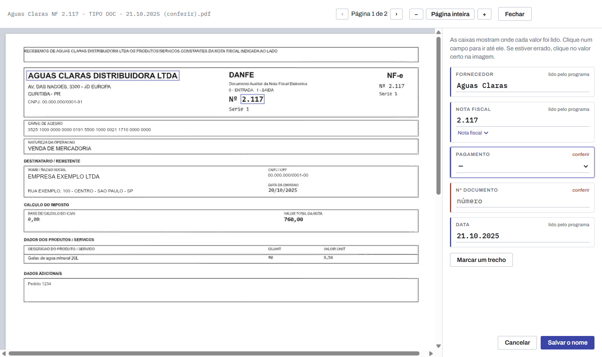

<div align="center">

# 📄 Renomeador de comprovantes

**Arraste os PDFs de nota fiscal + comprovante de pagamento.<br>O programa lê cada um e dá o nome certo — sozinho.**

[](https://github.com/trvp4/renomeador-releases/releases/latest) [](#-o-que-precisa) [](#-atualizações)

### [⬇️ Baixar para Windows](https://github.com/trvp4/renomeador-releases/releases/latest)

<sub>Na página que abrir, clique em <b>Renomeador-instalador-….exe</b></sub>

<br>



</div>

---

## ✨ O que ele faz

Você tem uma pasta cheia de PDFs escaneados, cada um com a **nota fiscal** e o **comprovante de pagamento** do banco. O Renomeador lê cada arquivo e troca o nome:

```text
scan_0042.pdf   →   Papelaria Aurora NF 3.482 - PIX 45.219 - 12.08.2025.pdf
```

O nome sempre segue o mesmo padrão:

| Parte | Exemplo | De onde sai |
|---|---|---|
| Fornecedor | `Papelaria Aurora` | quem emitiu a nota / quem recebeu o pagamento |
| Nota fiscal | `NF 3.482` | o número impresso na nota (cobrança sem nota sai como `FAT`) |
| Pagamento | `PIX`, `TED`, `TRANSF` ou `PGO TITULO` | o tipo do comprovante |
| Nº do documento | `45.219` | o número do comprovante |
| Data | `12.08.2025` | a data do pagamento |

> **Ele não chuta.** Quando não tem certeza de alguma parte, o arquivo vai para uma pasta **Revisar**, com o motivo, para você conferir em um minuto. Um nome errado passando despercebido é pior do que um arquivo a mais para olhar.

---

## 📥 Como instalar

1. Abra a **[página de download](https://github.com/trvp4/renomeador-releases/releases/latest)** e clique em **`Renomeador-instalador-….exe`**.
2. Abra o arquivo baixado. Ele instala sozinho, sem pedir senha de administrador, e cria um atalho **Renomeador** na área de trabalho.
3. Se aparecer a tela azul **"O Windows protegeu o computador"**, clique em **Mais informações** → **Executar assim mesmo**.<br><sub>Isso aparece porque o programa não tem uma assinatura digital paga. É normal.</sub>
4. Na primeira vez, o programa pede a **chave de acesso**. Cole a chave que a pessoa que te passou o programa enviou.

<details>
<summary><b>Instalador ou portátil?</b></summary>
<br>

| Arquivo | Para quem |
|---|---|
| `Renomeador-instalador-….exe` | **O normal.** Instala, cria atalho e **se atualiza sozinho**. |
| `Renomeador-portatil-….exe` | Computador onde não dá para instalar nada. Roda direto, mas **não se atualiza**. |

</details>

---

## 🖱️ Como usar



1. Abra o **Renomeador**.
2. **Arraste os PDFs** para dentro da janela (ou clique em **Escolher arquivos**).
3. Clique em **Renomear**.
4. Pronto. Os arquivos ficam com o nome novo **na mesma pasta onde estavam**.

Enquanto lê, cada arquivo vira uma ficha com as cinco partes do nome, preenchidas na hora.

Se mudar de ideia, **Desfazer** devolve todos os arquivos da última leva aos nomes antigos — mesmo depois de fechar e abrir o programa.

<br clear="right">

---

## 🔍 Quando precisa conferir

O arquivo duvidoso vai para a pasta **`Revisar`**, ao lado dos outros, com `(conferir)` no fim do nome. A ficha mostra o motivo — por exemplo, *"não consegui ler: nº do documento"*.

Clique em **Conferir na imagem**: a página do documento aparece ao lado dos campos, com uma caixa mostrando de onde cada valor foi lido.

<div align="center">

</div>

- **Clique num campo** e a imagem vai até ele.
- **Está errado?** Clique no valor certo na imagem e o campo é preenchido.
- **A palavra não foi reconhecida?** Use **Marcar um trecho**: arraste um retângulo sobre ela e o programa lê só aquele pedaço, de vários jeitos, e mostra as leituras para você escolher.
- **Salvar o nome** renomeia o arquivo e tira ele da pasta `Revisar`.

Prefere digitar? **Corrigir o nome** abre os campos para você preencher à mão.

---

## 🧠 Ele aprende com você

Cada conferência ensina o programa sobre os seus fornecedores:

- reconhece **pelo CNPJ** um fornecedor que você já confirmou, e usa o nome que você aprovou;
- lembra como a leitura costuma errar o nome dele, e já sugere o certo;
- aprende **onde** cada informação fica nos documentos daquele fornecedor, e manda para conferência quando um valor vem de um lugar estranho;
- percebe os tipos de leitura que você mais corrige, e passa a conferi-los sempre.

Só o que **você confirmou** vira confiança. Tudo fica guardado no seu computador.

---

## 🔄 Atualizações

A versão instalada procura atualizações sozinha ao abrir. Quando há uma nova, ela é baixada em segundo plano e aplicada **quando você fecha o programa**. O rodapé avisa quando isso acontece, e mostra a versão atual no canto direito.

Veja o que mudou em cada versão na **[lista de versões](https://github.com/trvp4/renomeador-releases/releases)**.

---

## 💻 O que precisa

- **Windows 10 ou 11**, com o idioma **português** instalado (é o leitor de texto do próprio Windows que lê os documentos)
- **Internet**
- A **chave de acesso** enviada por quem te passou o programa

Os comprovantes do **Banco do Brasil** são os mais testados. Os de outros bancos funcionam, mas tendem a ir mais vezes para conferência — o que é seguro.

---

## ❓ Perguntas comuns

<details>
<summary><b>O programa mexe no conteúdo dos meus PDFs?</b></summary>
<br>
Não. Ele só troca o <b>nome</b> do arquivo (e move os duvidosos para a pasta <code>Revisar</code>). O conteúdo continua igual, e o <b>Desfazer</b> volta os nomes antigos.
</details>

<details>
<summary><b>Apareceu "sem internet" ou "chave recusada". Perdi alguma coisa?</b></summary>
<br>
Não. Nesses casos o programa para antes de mexer em qualquer arquivo e avisa o que fazer. Os que faltavam continuam na fila para tentar de novo.
</details>

<details>
<summary><b>Posso fechar o programa no meio?</b></summary>
<br>
Pode usar <b>Parar</b>: ele termina o arquivo atual e para. Se fechar a janela no meio, ele pergunta antes.
</details>

<details>
<summary><b>Os meus documentos vão para algum lugar?</b></summary>
<br>
O texto lido de cada documento é enviado ao serviço de inteligência artificial que escolhe os valores certos (TypeSafe). Os PDFs em si não são enviados. As conferências ficam guardadas só no seu computador; o botão <b>Casos para melhorar</b> junta num arquivo, se você quiser mandar para quem mantém o programa — e avisa antes o que vai junto.
</details>

<details>
<summary><b>Deu algum problema. Como peço ajuda?</b></summary>
<br>
Clique no <b>número da versão</b>, no canto de baixo da janela. Isso copia um diagnóstico (versão, sistema e as últimas ações, <b>sem o conteúdo dos documentos</b>). Cole numa mensagem para quem te passou o programa.
</details>

---

<div align="center">
<sub>Feito para acabar com a digitação de nomes de arquivo, um comprovante de cada vez.</sub>
</div>
